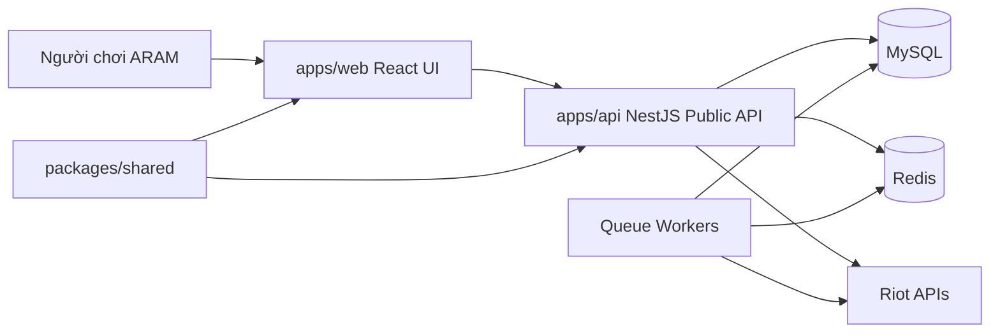

# ARAM Meta System Model

## Mục Đích

Tài liệu này định nghĩa nền kiến trúc trước khi scaffold frontend hoặc backend. Mọi task triển khai phải giữ bốn phẩm chất sản phẩm: tính kế thừa, tính duy trì, hướng tới khách hàng và tính mở rộng.

## Nguyên Tắc Kiến Trúc

1. Khách hàng trước: màn hình đầu tiên phải hỗ trợ tìm tướng/build thật nhanh.
2. Riot boundary ở server: chỉ backend được gọi Riot API hoặc giữ `RIOT_API_KEY`.
3. Contract-first frontend: web UI dùng type của dự án, không dùng raw Riot response.
4. Monorepo inheritance: app và package chia sẻ type qua npm workspaces.
5. Operational readiness từ ngày đầu: mỗi app có build, test, smoke và health/status path.
6. Evolutionary architecture: bắt đầu bằng modular app/API shell, chỉ tách service khi scale hoặc ownership yêu cầu.
7. Design inheritance: màu sắc, spacing, radius, typography của frontend kế thừa từ `docs/design/`.

## System Context

## Container Boundaries

| Container | Trách nhiệm | Không được làm |
| --- | --- | --- |
| `apps/web` | Render UI guide ARAM, search, tier preview, trạng thái dữ liệu. | Lưu secret, gọi Riot trực tiếp, tính aggregate data. |
| `apps/api` | Public REST API, health, config validation, DTO mapping, cache reads. | Trả raw Riot payload cho frontend. |
| `packages/shared` | DTO, constants và public API response types dùng chung. | Import runtime code riêng của app. |
| MySQL | Durable store cho static, match, aggregate và editorial data. | Lưu queue state tạm thời. |
| Redis | Cache, queue state, rate-limit coordination. | Là source of truth cho stats bền vững. |
| Workers | Riot ingestion, static sync, aggregate jobs. | Serve browser traffic trực tiếp. |

## Frontend Data Flow

1. `apps/web` render mock data có shape gần public API DTO.
2. Khi `apps/api` có endpoint, frontend thay mock adapter bằng API client.
3. Backend map database/cache data sang DTO trong `packages/shared`.
4. Riot secrets luôn ở server-side.

## Quality Attribute Scenarios

| Scenario | Target |
| --- | --- |
| Người chơi mở mobile home khi đang chọn tướng. | Search và tier preview nằm trong first screen. |
| Backend chưa sẵn sàng. | Frontend vẫn build/test được bằng mock API-shaped data. |
| Design palette đổi. | Cập nhật Tailwind theme một chỗ trong `styles.css`. |
| Traffic public tăng. | Thêm API cache/workers mà không đổi component contract. |
| Riot API rate limit. | Backend/worker xử lý retry/pause; frontend nhận stale/loading/error state. |

## Initial SLI Candidates

| SLI | Lý do |
| --- | --- |
| Home interactive latency | Người chơi cần build guidance nhanh khi đang chọn tướng. |
| Public API error rate | Tier/champion page phải đáng tin. |
| Data freshness age | Meta data mất giá trị khi stale sau patch. |
| Search success rate | Champion lookup là workflow lõi. |

## Evolution Path

1. Phase 1: monorepo, web shell, API shell, shared package, MySQL/Redis local.
2. Phase 2: public guide endpoints và typed frontend data adapter.
3. Phase 3: Riot ingestion workers và aggregate stats.
4. Phase 4+: player lookup, community, desktop companion qua cùng public API boundary.
