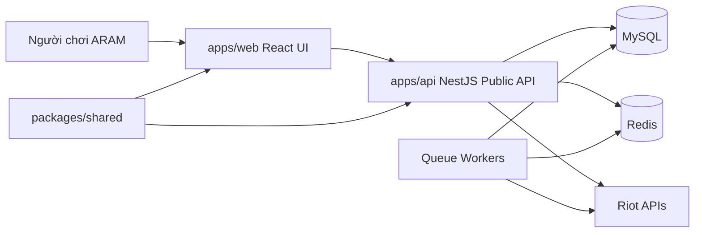

# Scaffold Frontend React TypeScript Implementation Plan

> **For agentic workers:** REQUIRED SUB-SKILL: Use superpowers:subagent-driven-development (recommended) or superpowers:executing-plans to implement this plan task-by-task. Steps use checkbox (`- [ ]`) syntax for tracking.

**Goal:** Hoàn thiện checklist item "Scaffold frontend React + TypeScript" trên nền kiến trúc hệ thống rõ ràng, UI dùng Tailwind là chính, kế thừa màu sắc/layout từ `docs/design/`, dễ duy trì và mở rộng.

**Architecture:** Trước khi scaffold UI, tạo mô hình kiến trúc hệ thống C4-lite gồm System Context, Container Boundaries, Data Flow và Quality Attributes. Frontend `apps/web` là presentation layer, không giữ secret, không gọi Riot API trực tiếp, dùng dữ liệu mock có shape gần với public API để sau này đổi sang backend ít chạm UI. UI dùng Tailwind CSS v4 qua Vite plugin; token màu/spacing/radius được định nghĩa bằng `@theme` trong CSS và map từ `docs/design/design-system.md`.

**Tech Stack:** React 19, TypeScript 5.9, Vite 7, Tailwind CSS v4, `@tailwindcss/vite`, npm workspaces, Vitest, React Testing Library, lucide-react.

**Spec:** `docs/phases/phase-1-technical-foundation.md`; `docs/architecture/overview.md`; `docs/design/design-system.md`; `docs/design/design-direction.md`; `docs/design/page-layouts.md`

## Global Constraints

- Frontend bắt buộc dùng React + TypeScript.
- `apps/web` là đầu ra của Phase 1.
- Frontend không gọi Riot API trực tiếp.
- Không có Riot API key hard-coded trong repo.
- Màu sắc, spacing, radius, typography và layout phải kế thừa từ `docs/design/`.
- Tailwind utilities là cách thiết kế UI chính; CSS thường chỉ dùng cho `@import`, `@theme`, base layer và accessibility helper.
- UI phải ưu tiên tốc độ tra cứu cho người chơi ARAM, đặc biệt trên mobile.
- Kiến trúc phải tối ưu cho tính kế thừa, tính duy trì, hướng tới khách hàng, tính mở rộng, reliability, security và operational excellence.

---

## Architecture And Design Guardrails

| Thuộc tính | Quyết định bắt buộc | Nguồn kế thừa |
| --- | --- | --- |
| Hướng tới khách hàng | Màn hình đầu tiên phải thấy search và tier preview nhanh, không biến thành landing page marketing. | `docs/design/design-direction.md` |
| Tính duy trì | `main.tsx` chỉ mount app; UI chia theo component/feature nhỏ. | `docs/architecture/system-model.md` |
| Tính kế thừa | Token Tailwind phải map từ `docs/design/design-system.md`. | `apps/web/src/styles.css` |
| Tính mở rộng | Mock data dùng type gần public API để sau này thay bằng backend adapter. | `apps/web/src/features/meta/` |
| Security | Browser không chứa secret và không gọi Riot API. | `docs/architecture/system-model.md` |
| Operational excellence | Có script dev/build/test và smoke check rõ ràng. | `package.json`, `README.md` |

## Big Tech Reference Mapping

- AWS/Azure Well-Architected: dùng các pillar reliability, security, performance efficiency và operational excellence để review nền tảng.
- Google SRE: ưu tiên SLI/SLO theo hành vi người dùng như search responsiveness, API health và data freshness.
- Amazon Builders' Library: ownership, vận hành và resilience không để đến sau.
- Netflix API architecture: frontend đi qua public API/BFF boundary, không nối trực tiếp nhiều domain service.
- Meta monorepo engineering: workspaces/shared package giúp kế thừa type và refactor đa app.

## File Structure

- Create: `docs/architecture/system-model.md`
  - Mô hình hệ thống, boundaries, data flow, quality attributes và evolution path.
- Modify: `docs/architecture/overview.md`
  - Link sang system model và nhấn mạnh boundary frontend/backend/shared.
- Modify: `package.json`
  - Root workspace scripts cho web dev/build/test/preview.
- Modify: `apps/web/package.json`
  - Thêm Tailwind, test tooling và scripts.
- Modify: `apps/web/vite.config.ts`
  - Dùng React plugin, Tailwind Vite plugin và Vitest config.
- Modify: `apps/web/tsconfig.json`
  - Strict React TypeScript và Vitest globals.
- Modify: `apps/web/tsconfig.node.json`
  - TypeScript settings cho Vite config.
- Modify: `apps/web/src/styles.css`
  - `@import "tailwindcss"`, `@theme` token kế thừa từ design docs, base layer tối thiểu.
- Modify: `apps/web/src/main.tsx`
  - Mount React root.
- Create: `apps/web/src/App.tsx`
  - App composition.
- Create: `apps/web/src/components/AppHeader.tsx`
  - Header/search/navigation bằng Tailwind utilities.
- Create: `apps/web/src/components/TierBadge.tsx`
  - Tier badge bằng Tailwind token classes.
- Create: `apps/web/src/features/meta/meta.types.ts`
  - Type cho meta preview.
- Create: `apps/web/src/features/meta/mockMeta.ts`
  - Mock data tiếng Việt có dấu.
- Create: `apps/web/src/features/meta/MetaHome.tsx`
  - Home/tier preview theo layout từ `docs/design/page-layouts.md`.
- Create: `apps/web/src/test/setup.ts`
  - Testing Library jest-dom setup.
- Create: `apps/web/src/App.test.tsx`
  - Tests cho customer workflow và tiếng Việt có dấu.
- Create: `apps/web/src/styles.theme.test.ts`
  - Test token Tailwind kế thừa từ design docs.
- Modify: `apps/web/index.html`
  - Metadata tiếng Việt có dấu.
- Modify: `README.md`
  - Hướng dẫn local, Tailwind và boundary kiến trúc.

## Task 0: Tạo Mô Hình Kiến Trúc Hệ Thống Trước

**Files:**
- Create: `docs/architecture/system-model.md`
- Modify: `docs/architecture/overview.md`

**Interfaces:**
- Consumes: Phase 1 spec, existing architecture overview.
- Produces: nguồn chuẩn để frontend/backend/shared cùng kế thừa.

- [ ] **Step 1: Tạo system model**

Create `docs/architecture/system-model.md`:

````markdown
# ARAM Meta System Model

## Mục Đích

Tài liệu này định nghĩa nền kiến trúc trước khi scaffold frontend hoặc backend. Mọi task triển khai phải giữ bốn phẩm chất sản phẩm: tính kế thừa, tính duy trì, hướng tới khách hàng và tính mở rộng.

## Nguyên Tắc Kiến Trúc

1. Khách hàng trước: màn hình đầu tiên phải hỗ trợ tìm tướng/build thật nhanh.
2. Riot boundary ở server: chỉ backend được gọi Riot API hoặc giữ `RIOT_API_KEY`.
3. Contract-first frontend: web UI dùng type của dự án, không dùng raw Riot response.
4. Monorepo inheritance: app và package chia sẻ type qua npm workspaces.
5. Operational readiness từ ngày đầu: mỗi app có build, test, smoke và health/status path.
6. Evolutionary architecture: bắt đầu bằng modular app/API shell, chỉ tách service khi scale hoặc ownership yêu cầu.
7. Design inheritance: màu sắc, spacing, radius, typography của frontend kế thừa từ `docs/design/`.

## System Context



## Container Boundaries

| Container | Trách nhiệm | Không được làm |
| --- | --- | --- |
| `apps/web` | Render UI guide ARAM, search, tier preview, trạng thái dữ liệu. | Lưu secret, gọi Riot trực tiếp, tính aggregate data. |
| `apps/api` | Public REST API, health, config validation, DTO mapping, cache reads. | Trả raw Riot payload cho frontend. |
| `packages/shared` | DTO, constants và public API response types dùng chung. | Import runtime code riêng của app. |
| MySQL | Durable store cho static, match, aggregate và editorial data. | Lưu queue state tạm thời. |
| Redis | Cache, queue state, rate-limit coordination. | Là source of truth cho stats bền vững. |
| Workers | Riot ingestion, static sync, aggregate jobs. | Serve browser traffic trực tiếp. |

## Frontend Data Flow

1. `apps/web` render mock data có shape gần public API DTO.
2. Khi `apps/api` có endpoint, frontend thay mock adapter bằng API client.
3. Backend map database/cache data sang DTO trong `packages/shared`.
4. Riot secrets luôn ở server-side.

## Quality Attribute Scenarios

| Scenario | Target |
| --- | --- |
| Người chơi mở mobile home khi đang chọn tướng. | Search và tier preview nằm trong first screen. |
| Backend chưa sẵn sàng. | Frontend vẫn build/test được bằng mock API-shaped data. |
| Design palette đổi. | Cập nhật Tailwind theme một chỗ trong `styles.css`. |
| Traffic public tăng. | Thêm API cache/workers mà không đổi component contract. |
| Riot API rate limit. | Backend/worker xử lý retry/pause; frontend nhận stale/loading/error state. |

## Initial SLI Candidates

| SLI | Lý do |
| --- | --- |
| Home interactive latency | Người chơi cần build guidance nhanh khi đang chọn tướng. |
| Public API error rate | Tier/champion page phải đáng tin. |
| Data freshness age | Meta data mất giá trị khi stale sau patch. |
| Search success rate | Champion lookup là workflow lõi. |

## Evolution Path

1. Phase 1: monorepo, web shell, API shell, shared package, MySQL/Redis local.
2. Phase 2: public guide endpoints và typed frontend data adapter.
3. Phase 3: Riot ingestion workers và aggregate stats.
4. Phase 4+: player lookup, community, desktop companion qua cùng public API boundary.
````

- [ ] **Step 2: Link system model từ overview**

Append vào `docs/architecture/overview.md`:

```markdown
## System Model

Mô hình hệ thống chi tiết nằm ở [system-model.md](system-model.md). Mọi implementation task phải kế thừa các boundary này:

- `apps/web` chỉ là presentation layer.
- `apps/api` sở hữu backend API và server-side integrations.
- `packages/shared` sở hữu DTO/constants dùng chung.
- MySQL là durable data storage.
- Redis là cache, queue và rate-limit coordination.
- Riot API access luôn ở server-side.
```

- [ ] **Step 3: Verify**

Run: `Get-Content -LiteralPath docs/architecture/overview.md`

Expected: output có `system-model.md`, `apps/web`, `apps/api`, `packages/shared`, MySQL, Redis và Riot API boundary.

- [ ] **Step 4: Commit**

```bash
git add docs/architecture/system-model.md docs/architecture/overview.md
git commit -m "docs: define aram meta system architecture model"
```

## Task 1: Cấu Hình Workspace Tooling Cho Frontend Tailwind

**Files:**
- Modify: `package.json`
- Modify: `apps/web/package.json`

**Interfaces:**
- Consumes: npm workspace `apps/web`.
- Produces: scripts `dev:web`, `build:web`, `test:web`, `preview:web` và Tailwind runtime qua Vite.

- [ ] **Step 1: Update root scripts**

Set root `scripts` block:

```json
{
  "dev:web": "npm --workspace apps/web run dev",
  "build:web": "npm --workspace apps/web run build",
  "test:web": "npm --workspace apps/web run test",
  "preview:web": "npm --workspace apps/web run preview"
}
```

- [ ] **Step 2: Update frontend package**

Set `apps/web/package.json`:

```json
{
  "name": "@aram-meta/web",
  "private": true,
  "version": "0.1.0",
  "type": "module",
  "scripts": {
    "dev": "vite --host 127.0.0.1",
    "build": "tsc -b && vite build",
    "test": "vitest run",
    "test:watch": "vitest",
    "preview": "vite preview --host 127.0.0.1"
  },
  "dependencies": {
    "lucide-react": "^0.468.0",
    "react": "^19.1.0",
    "react-dom": "^19.1.0"
  },
  "devDependencies": {
    "@tailwindcss/vite": "^4.0.0",
    "@testing-library/jest-dom": "^6.6.3",
    "@testing-library/react": "^16.3.0",
    "@testing-library/user-event": "^14.6.1",
    "@types/react": "^19.1.0",
    "@types/react-dom": "^19.1.0",
    "@vitejs/plugin-react": "^5.0.0",
    "jsdom": "^26.1.0",
    "tailwindcss": "^4.0.0",
    "typescript": "^5.9.0",
    "vite": "^7.0.0",
    "vitest": "^3.2.4"
  }
}
```

- [ ] **Step 3: Install**

Run: `npm install`

Expected: npm exits successfully and `package-lock.json` exists or updates.

- [ ] **Step 4: Commit**

```bash
git add package.json package-lock.json apps/web/package.json
git commit -m "chore: configure frontend tailwind workspace tooling"
```

## Task 2: Cấu Hình Vite, TypeScript Và Test Runtime

**Files:**
- Modify: `apps/web/vite.config.ts`
- Modify: `apps/web/tsconfig.json`
- Modify: `apps/web/tsconfig.node.json`
- Create: `apps/web/src/test/setup.ts`

**Interfaces:**
- Consumes: dependencies từ Task 1.
- Produces: Vite + Tailwind plugin, strict TypeScript, jsdom component tests.

- [ ] **Step 1: Update Vite config**

Replace `apps/web/vite.config.ts`:

```ts
import tailwindcss from "@tailwindcss/vite";
import react from "@vitejs/plugin-react";
import { defineConfig } from "vitest/config";

export default defineConfig({
  plugins: [react(), tailwindcss()],
  test: {
    environment: "jsdom",
    globals: true,
    setupFiles: "./src/test/setup.ts",
  },
});
```

- [ ] **Step 2: Update browser TypeScript config**

Replace `apps/web/tsconfig.json`:

```json
{
  "compilerOptions": {
    "target": "ES2022",
    "useDefineForClassFields": true,
    "lib": ["DOM", "DOM.Iterable", "ES2022"],
    "allowJs": false,
    "skipLibCheck": true,
    "esModuleInterop": true,
    "allowSyntheticDefaultImports": true,
    "strict": true,
    "forceConsistentCasingInFileNames": true,
    "module": "ESNext",
    "moduleResolution": "Bundler",
    "resolveJsonModule": true,
    "isolatedModules": true,
    "noEmit": true,
    "jsx": "react-jsx",
    "types": ["vitest/globals", "@testing-library/jest-dom"]
  },
  "include": ["src"],
  "references": [{ "path": "./tsconfig.node.json" }]
}
```

- [ ] **Step 3: Update Node TypeScript config**

Replace `apps/web/tsconfig.node.json`:

```json
{
  "compilerOptions": {
    "composite": true,
    "skipLibCheck": true,
    "module": "ESNext",
    "moduleResolution": "Bundler",
    "allowSyntheticDefaultImports": true,
    "types": ["vitest/config"]
  },
  "include": ["vite.config.ts"]
}
```

- [ ] **Step 4: Add test setup**

Create `apps/web/src/test/setup.ts`:

```ts
import "@testing-library/jest-dom/vitest";
```

- [ ] **Step 5: Commit**

```bash
git add apps/web/vite.config.ts apps/web/tsconfig.json apps/web/tsconfig.node.json apps/web/src/test/setup.ts
git commit -m "chore: configure frontend vite tailwind tests"
```

## Task 3: Tạo Tailwind Theme Kế Thừa Từ Design Docs

**Files:**
- Modify: `apps/web/src/styles.css`
- Create: `apps/web/src/styles.theme.test.ts`

**Interfaces:**
- Consumes: `docs/design/design-system.md`.
- Produces: Tailwind theme variables dùng được qua class như `bg-bg`, `text-text`, `border-border`, `rounded-lg`, `max-w-app`.

- [ ] **Step 1: Replace global stylesheet**

Replace `apps/web/src/styles.css`:

```css
@import "tailwindcss";

@theme {
  --color-bg: #0b0d10;
  --color-bg-elevated: #12161c;
  --color-surface: #171c23;
  --color-surface-hover: #202733;
  --color-border: #2b3442;
  --color-border-strong: #3f4b5d;
  --color-text: #f3f6fa;
  --color-text-muted: #a8b3c2;
  --color-text-dim: #6f7b8a;
  --color-accent: #d9a441;
  --color-accent-soft: #473718;
  --color-info: #38bdf8;
  --color-success: #22c55e;
  --color-danger: #ef4444;
  --color-warning: #f59e0b;
  --color-purple: #a78bfa;

  --color-tier-s-plus-text: #fff7d6;
  --color-tier-s-plus-bg: #5c3b00;
  --color-tier-s-plus-border: #d9a441;
  --color-tier-s-text: #fde68a;
  --color-tier-s-bg: #3f2a05;
  --color-tier-s-border: #b8831f;
  --color-tier-a-text: #baf7d0;
  --color-tier-a-bg: #0f3d25;
  --color-tier-a-border: #22c55e;
  --color-tier-b-text: #bfe9ff;
  --color-tier-b-bg: #10384d;
  --color-tier-b-border: #38bdf8;

  --font-sans: Inter, Arial, sans-serif;
  --text-xs: 12px;
  --text-sm: 14px;
  --text-base: 16px;
  --text-lg: 18px;
  --text-xl: 22px;
  --text-2xl: 28px;
  --text-3xl: 36px;
  --radius-sm: 4px;
  --radius-md: 6px;
  --radius-lg: 8px;
  --container-app: 1280px;
}

@layer base {
  * {
    box-sizing: border-box;
  }

  body {
    margin: 0;
    min-width: 320px;
    min-height: 100vh;
    background: var(--color-bg);
    color: var(--color-text);
    font-family: var(--font-sans);
    font-synthesis: none;
    text-rendering: optimizeLegibility;
  }

  button,
  input {
    font: inherit;
  }

  button {
    cursor: pointer;
  }
}

@layer utilities {
  .sr-only {
    position: absolute;
    width: 1px;
    height: 1px;
    overflow: hidden;
    clip: rect(0, 0, 0, 0);
    white-space: nowrap;
  }
}
```

- [ ] **Step 2: Add theme regression test**

Create `apps/web/src/styles.theme.test.ts`:

```ts
import stylesCss from "./styles.css?raw";

const requiredThemeTokens = [
  "--color-bg",
  "--color-bg-elevated",
  "--color-surface",
  "--color-border",
  "--color-text",
  "--color-text-muted",
  "--color-accent",
  "--color-info",
  "--color-success",
  "--color-tier-s-bg",
  "--color-tier-a-bg",
  "--radius-lg",
  "--container-app",
];

describe("Tailwind theme kế thừa từ design docs", () => {
  it("định nghĩa đầy đủ token lõi", () => {
    for (const token of requiredThemeTokens) {
      expect(stylesCss).toContain(token);
    }
  });
});
```

- [ ] **Step 3: Run theme test**

Run: `npm run test:web -- src/styles.theme.test.ts`

Expected: PASS.

- [ ] **Step 4: Commit**

```bash
git add apps/web/src/styles.css apps/web/src/styles.theme.test.ts
git commit -m "style: add tailwind theme from design system"
```

## Task 4: Tách Frontend Thành Component Dễ Duy Trì

**Files:**
- Modify: `apps/web/src/main.tsx`
- Create: `apps/web/src/App.tsx`
- Create: `apps/web/src/components/AppHeader.tsx`
- Create: `apps/web/src/components/TierBadge.tsx`
- Create: `apps/web/src/features/meta/meta.types.ts`
- Create: `apps/web/src/features/meta/mockMeta.ts`
- Create: `apps/web/src/features/meta/MetaHome.tsx`
- Modify: `apps/web/index.html`

**Interfaces:**
- Consumes: Tailwind theme từ Task 3.
- Produces: UI shell dùng Tailwind utilities là chính, copy tiếng Việt có dấu, mock data API-shaped.

- [ ] **Step 1: Define meta types**

Create `apps/web/src/features/meta/meta.types.ts`:

```ts
export type Tier = "S+" | "S" | "A" | "B";

export type ChampionTierPreview = {
  rank: number;
  championName: string;
  roleLabel: string;
  tier: Tier;
  winRate: string;
  pickRate: string;
  sampleSize: string;
  coreBuild: string[];
  accentClassName: string;
};

export type MetaSnapshot = {
  patch: string;
  region: string;
  updatedLabel: string;
  sampleSize: string;
  dataState: "sample" | "fresh" | "stale";
};
```

- [ ] **Step 2: Create Vietnamese mock data**

Create `apps/web/src/features/meta/mockMeta.ts`:

```ts
import type { ChampionTierPreview, MetaSnapshot } from "./meta.types";

export const metaSnapshot: MetaSnapshot = {
  patch: "16.17",
  region: "VN + Global",
  updatedLabel: "Dữ liệu mẫu",
  sampleSize: "132.6M",
  dataState: "sample",
};

export const championTierPreview: ChampionTierPreview[] = [
  {
    rank: 1,
    championName: "Jinx",
    roleLabel: "Xạ thủ",
    tier: "S",
    winRate: "54.2%",
    pickRate: "12.1%",
    sampleSize: "18k",
    coreBuild: ["Móc", "Cuồng", "Cung", "Vô", "Giày"],
    accentClassName: "border-info",
  },
  {
    rank: 2,
    championName: "Lux",
    roleLabel: "Pháp sư cấu rỉa",
    tier: "S",
    winRate: "53.1%",
    pickRate: "11.3%",
    sampleSize: "17k",
    coreBuild: ["Bão", "Vọng", "Mũ", "Trượng", "Giày"],
    accentClassName: "border-accent",
  },
  {
    rank: 3,
    championName: "Varus",
    roleLabel: "Poke / DPS",
    tier: "S",
    winRate: "52.6%",
    pickRate: "10.0%",
    sampleSize: "15k",
    coreBuild: ["Kiếm", "Thần", "Cung", "Xuyên", "Giày"],
    accentClassName: "border-purple",
  },
];
```

- [ ] **Step 3: Create TierBadge**

Create `apps/web/src/components/TierBadge.tsx`:

```tsx
import type { Tier } from "../features/meta/meta.types";

type TierBadgeProps = {
  tier: Tier;
};

const tierClassName: Record<Tier, string> = {
  "S+": "border-tier-s-plus-border bg-tier-s-plus-bg text-tier-s-plus-text",
  S: "border-tier-s-border bg-tier-s-bg text-tier-s-text",
  A: "border-tier-a-border bg-tier-a-bg text-tier-a-text",
  B: "border-tier-b-border bg-tier-b-bg text-tier-b-text",
};

export function TierBadge({ tier }: TierBadgeProps) {
  return (
    <span className={`inline-grid min-h-7 w-16 place-items-center rounded-md border text-xs font-black ${tierClassName[tier]}`}>
      {tier}
    </span>
  );
}
```

- [ ] **Step 4: Create AppHeader**

Create `apps/web/src/components/AppHeader.tsx`:

```tsx
import { ChevronDown, Search } from "lucide-react";

export function AppHeader() {
  return (
    <header className="grid min-h-16 grid-cols-1 items-center gap-4 border-b border-border py-3 lg:grid-cols-[auto_minmax(220px,340px)_1fr_auto] lg:gap-5">
      <a className="inline-flex items-center gap-3 text-xl font-extrabold text-text no-underline" href="/" aria-label="ARAM Meta home">
        <span className="grid size-[42px] place-items-center rounded-lg border border-accent bg-accent-soft text-xs text-tier-s-plus-text">AM</span>
        <span>
          ARAM <strong className="text-accent">Meta</strong>
        </span>
      </a>

      <label className="flex h-11 items-center gap-2 rounded-lg border border-border bg-bg-elevated px-4 text-text-muted">
        <Search size={18} aria-hidden="true" />
        <span className="sr-only">Tìm tướng</span>
        <input className="w-full border-0 bg-transparent text-text outline-none" aria-label="Tìm tướng ARAM" placeholder="Tìm tướng ARAM..." />
      </label>

      <nav className="flex gap-5 overflow-x-auto pb-2 text-sm font-bold lg:pb-0" aria-label="Trang chính">
        <a className="text-text" href="#tier-list">Tier List</a>
        <a className="text-text-muted hover:text-text" href="#champions">Champions</a>
        <a className="text-text-muted hover:text-text" href="#guides">Guides</a>
      </nav>

      <button className="inline-flex min-h-10 items-center justify-center gap-2 rounded-lg border border-border bg-bg-elevated px-3 font-extrabold text-text" type="button">
        Patch 16.17
        <ChevronDown size={16} aria-hidden="true" />
      </button>
    </header>
  );
}
```

- [ ] **Step 5: Create MetaHome**

Create `apps/web/src/features/meta/MetaHome.tsx`:

```tsx
import { ArrowRight, BarChart3, Clock3, Flame, Globe2, Search, Shield, Sparkles } from "lucide-react";
import { TierBadge } from "../../components/TierBadge";
import { championTierPreview, metaSnapshot } from "./mockMeta";

export function MetaHome() {
  return (
    <>
      <section className="grid grid-cols-1 gap-5 py-8 lg:grid-cols-[minmax(0,1fr)_360px]" aria-labelledby="home-title">
        <div className="rounded-lg border border-border bg-bg-elevated p-6">
          <div className="inline-flex items-center gap-2 text-xs font-extrabold text-accent">
            <Sparkles size={16} aria-hidden="true" />
            ARAM guide theo patch
          </div>
          <h1 id="home-title" className="mt-3 max-w-[760px] text-3xl font-black leading-[44px] tracking-normal text-text">
            Tìm build ARAM đúng meta trong vài giây.
          </h1>
          <p className="mt-3 max-w-[680px] text-base leading-7 text-text-muted">
            Tra cứu tướng, xem core item và số liệu quan trọng trước khi trận đấu bắt đầu.
          </p>

          <label className="mt-6 flex min-h-14 max-w-[720px] items-center gap-2 rounded-lg border border-border bg-bg-elevated pl-4 text-text-muted max-sm:flex-col max-sm:items-stretch max-sm:p-3">
            <Search size={20} aria-hidden="true" />
            <span className="sr-only">Nhập tên tướng</span>
            <input className="w-full border-0 bg-transparent text-text outline-none" aria-label="Nhập tên tướng" placeholder="Nhập tên tướng: Jinx, Lux, Varus..." />
            <button className="inline-flex min-h-14 min-w-[132px] items-center justify-center gap-2 rounded-lg border border-accent bg-accent px-4 font-extrabold text-bg max-sm:w-full" type="button">
              Xem build
              <ArrowRight size={16} aria-hidden="true" />
            </button>
          </label>
        </div>

        <aside className="rounded-lg border border-border bg-bg-elevated p-6" aria-label="Trạng thái dữ liệu meta">
          <div className="mb-4 flex items-center gap-2 font-extrabold text-text">
            <BarChart3 size={18} aria-hidden="true" />
            Meta Snapshot
          </div>
          <dl className="grid gap-3">
            <div className="flex justify-between gap-3 border-b border-border pb-3">
              <dt className="text-text-dim">Patch</dt>
              <dd className="m-0 font-extrabold text-text">{metaSnapshot.patch}</dd>
            </div>
            <div className="flex justify-between gap-3 border-b border-border pb-3">
              <dt className="text-text-dim">Cập nhật</dt>
              <dd className="m-0 font-extrabold text-text">{metaSnapshot.updatedLabel}</dd>
            </div>
            <div className="flex justify-between gap-3 border-b border-border pb-3">
              <dt className="text-text-dim">Region</dt>
              <dd className="m-0 font-extrabold text-text">{metaSnapshot.region}</dd>
            </div>
          </dl>
          <p className="mt-4 leading-7 text-text-muted">Dữ liệu hiển thị là mẫu UI và sẽ được thay bằng backend API ở checklist sau.</p>
        </aside>
      </section>

      <section className="overflow-hidden rounded-lg border border-border bg-bg-elevated" id="tier-list" aria-labelledby="tier-title">
        <div className="flex items-end justify-between gap-4 border-b border-border p-6 max-md:flex-col max-md:items-stretch">
          <div>
            <span className="inline-flex items-center gap-2 text-xs font-extrabold text-info">
              <Flame size={15} aria-hidden="true" />
              Đang mạnh
            </span>
            <h2 id="tier-title" className="mt-1 text-2xl font-black leading-9 text-text">ARAM Tier List</h2>
          </div>
          <div className="flex flex-wrap justify-end gap-3 max-sm:flex-col" aria-label="Bộ lọc tier list">
            <button className="inline-flex min-h-10 items-center justify-center gap-2 rounded-lg border border-border bg-bg-elevated px-3 font-extrabold text-text-muted" type="button"><Shield size={16} aria-hidden="true" />All Ranks</button>
            <button className="inline-flex min-h-10 items-center justify-center gap-2 rounded-lg border border-border bg-bg-elevated px-3 font-extrabold text-text-muted" type="button"><Globe2 size={16} aria-hidden="true" />All Regions</button>
            <button className="inline-flex min-h-10 items-center justify-center gap-2 rounded-lg border border-border bg-bg-elevated px-3 font-extrabold text-text-muted" type="button"><Clock3 size={16} aria-hidden="true" />10,000+ games</button>
          </div>
        </div>

        <div className="grid max-md:gap-3 max-md:p-5" role="table" aria-label="ARAM tier list">
          <div className="grid min-h-12 grid-cols-[44px_minmax(170px,1.6fr)_80px_72px_72px_76px_minmax(190px,1.2fr)] items-center gap-3 border-b border-border px-6 text-xs font-extrabold text-text-muted max-md:hidden" role="row">
            <span>#</span><span>Champion</span><span>Tier</span><span>Win</span><span>Pick</span><span>Sample</span><span>Build</span>
          </div>
          {championTierPreview.map((champion) => (
            <article className="grid min-h-[72px] grid-cols-[44px_minmax(170px,1.6fr)_80px_72px_72px_76px_minmax(190px,1.2fr)] items-center gap-3 border-b border-border px-6 text-text hover:bg-surface-hover max-md:min-h-0 max-md:grid-cols-[32px_minmax(0,1fr)_64px] max-md:rounded-lg max-md:border max-md:bg-surface max-md:p-3" role="row" key={champion.championName}>
              <span className="font-extrabold text-accent">{champion.rank}</span>
              <span className="flex min-w-0 items-center gap-3">
                <span className={`grid size-10 shrink-0 place-items-center rounded-lg border bg-surface font-black text-text ${champion.accentClassName}`}>{champion.championName.slice(0, 1)}</span>
                <span>
                  <strong className="block">{champion.championName}</strong>
                  <small className="block text-xs text-text-dim">{champion.roleLabel}</small>
                </span>
              </span>
              <TierBadge tier={champion.tier} />
              <span className="font-black text-success">{champion.winRate}</span>
              <span>{champion.pickRate}</span>
              <span>{champion.sampleSize}</span>
              <span className="flex min-w-0 items-center gap-2 max-md:col-span-full max-md:flex-wrap">
                {champion.coreBuild.map((item) => (
                  <span className="grid size-9 place-items-center overflow-hidden rounded-md border border-border-strong bg-surface text-center text-[9px] font-black text-text" key={`${champion.championName}-${item}`}>{item}</span>
                ))}
              </span>
            </article>
          ))}
        </div>
      </section>
    </>
  );
}
```

- [ ] **Step 6: Create App composition**

Create `apps/web/src/App.tsx`:

```tsx
import { AppHeader } from "./components/AppHeader";
import { MetaHome } from "./features/meta/MetaHome";

export function App() {
  return (
    <main className="mx-auto min-h-screen w-full max-w-app px-4 py-0 sm:px-5 lg:px-6">
      <AppHeader />
      <MetaHome />
    </main>
  );
}
```

- [ ] **Step 7: Replace root mount**

Replace `apps/web/src/main.tsx`:

```tsx
import { StrictMode } from "react";
import { createRoot } from "react-dom/client";
import { App } from "./App";
import "./styles.css";

createRoot(document.getElementById("root")!).render(
  <StrictMode>
    <App />
  </StrictMode>,
);
```

- [ ] **Step 8: Replace HTML metadata**

Replace `apps/web/index.html`:

```html
<!doctype html>
<html lang="vi">
  <head>
    <meta charset="UTF-8" />
    <meta name="viewport" content="width=device-width, initial-scale=1.0" />
    <meta
      name="description"
      content="ARAM Meta giúp người chơi ARAM tra cứu tướng mạnh, build phù hợp và số liệu theo patch."
    />
    <title>ARAM Meta</title>
  </head>
  <body>
    <div id="root"></div>
    <script type="module" src="/src/main.tsx"></script>
  </body>
</html>
```

- [ ] **Step 9: Verify Tailwind-first styling**

Run: `rg -n "className=.*bg-|className=.*text-|className=.*grid|className=.*flex" apps/web/src`

Expected: output shows Tailwind utility classes in `App.tsx`, `AppHeader.tsx`, `MetaHome.tsx`, and `TierBadge.tsx`.

- [ ] **Step 10: Commit**

```bash
git add apps/web/src/main.tsx apps/web/src/App.tsx apps/web/src/components apps/web/src/features apps/web/index.html
git commit -m "feat: add tailwind frontend app shell"
```

## Task 5: Thêm Tests Cho Customer Workflow Và Tiếng Việt Có Dấu

**Files:**
- Create: `apps/web/src/App.test.tsx`

**Interfaces:**
- Consumes: `App` từ Task 4.
- Produces: tests cho search, tier list, meta snapshot, mock data tiếng Việt có dấu.

- [ ] **Step 1: Create app tests**

Create `apps/web/src/App.test.tsx`:

```tsx
import { render, screen } from "@testing-library/react";
import userEvent from "@testing-library/user-event";
import { App } from "./App";

describe("App", () => {
  it("render shell tra cứu ARAM hướng tới khách hàng", () => {
    render(<App />);

    expect(screen.getByRole("link", { name: /aram meta home/i })).toBeInTheDocument();
    expect(screen.getByRole("textbox", { name: /tìm tướng aram/i })).toBeInTheDocument();
    expect(screen.getByRole("heading", { name: /tìm build aram đúng meta/i })).toBeInTheDocument();
    expect(screen.getByRole("table", { name: /aram tier list/i })).toBeInTheDocument();
  });

  it("hiển thị dữ liệu mẫu tiếng Việt có dấu", () => {
    render(<App />);

    expect(screen.getByText("Xạ thủ")).toBeInTheDocument();
    expect(screen.getByText("Pháp sư cấu rỉa")).toBeInTheDocument();
    expect(screen.getByText("Dữ liệu mẫu")).toBeInTheDocument();
    expect(screen.getByText("54.2%")).toBeInTheDocument();
  });

  it("cho phép nhập tên tướng", async () => {
    const user = userEvent.setup();
    render(<App />);

    const input = screen.getByRole("textbox", { name: /nhập tên tướng/i });
    await user.type(input, "Jinx");

    expect(input).toHaveValue("Jinx");
  });
});
```

- [ ] **Step 2: Run tests**

Run: `npm run test:web`

Expected: PASS.

- [ ] **Step 3: Run build**

Run: `npm run build:web`

Expected: PASS.

- [ ] **Step 4: Commit**

```bash
git add apps/web/src/App.test.tsx
git commit -m "test: cover vietnamese frontend workflow"
```

## Task 6: Document Frontend Tailwind Inheritance

**Files:**
- Modify: `README.md`

**Interfaces:**
- Consumes: architecture docs, design docs, Tailwind setup.
- Produces: local setup guide and implementation rules.

- [ ] **Step 1: Add frontend foundation section**

Append after technology direction in `README.md`:

````markdown
## Frontend Foundation

Frontend là React + TypeScript app trong `apps/web`. UI dùng Tailwind là chính và phải kế thừa từ:

- Architecture model: `docs/architecture/system-model.md`
- Design direction: `docs/design/design-direction.md`
- Design tokens: `docs/design/design-system.md`
- Layout rules: `docs/design/page-layouts.md`

Local commands:

```bash
npm install
npm run dev:web
npm run test:web
npm run build:web
```

Quy tắc:

- Không gọi Riot API từ browser code.
- Không hard-code Riot secrets trong frontend code.
- Không đặt raw color hex trong component; màu mới phải đi qua Tailwind `@theme` trong `apps/web/src/styles.css`.
- Copy UI tiếng Việt phải có dấu.
- Customer workflow phải nhanh: search và tier preview luôn là first-screen priority.
````

- [ ] **Step 2: Verify docs**

Run: `Get-Content -LiteralPath README.md`

Expected: README mentions Tailwind, `docs/design/design-system.md`, `docs/architecture/system-model.md`, tiếng Việt có dấu và Riot API boundary.

- [ ] **Step 3: Commit**

```bash
git add README.md
git commit -m "docs: document tailwind frontend inheritance"
```

## Final Verification

- [ ] **Step 1: Verify architecture model**

Run: `Test-Path docs/architecture/system-model.md`

Expected: `True`

- [ ] **Step 2: Verify Tailwind plugin**

Run: `rg -n "@tailwindcss/vite|tailwindcss\\(\\)" apps/web/vite.config.ts apps/web/package.json`

Expected: output shows `@tailwindcss/vite` and `tailwindcss()`.

- [ ] **Step 3: Verify Vietnamese copy**

Run: `rg -n "Tìm|tướng|Dữ liệu mẫu|Xạ thủ|Pháp sư" apps/web/src apps/web/index.html README.md`

Expected: output shows accented Vietnamese copy.

- [ ] **Step 4: Run all frontend tests**

Run: `npm run test:web`

Expected: PASS.

- [ ] **Step 5: Run frontend build**

Run: `npm run build:web`

Expected: PASS.

- [ ] **Step 6: Smoke run**

Run: `npm run dev:web`

Expected: Vite prints a local URL. Manual check desktop and 390px mobile:
- Search visible before long content.
- Tier preview scan-friendly.
- UI uses Tailwind utilities.
- Colors match `docs/design/design-system.md`.
- Text does not overlap.

## Self-Review

**Spec coverage:** Plan completes "Scaffold frontend React + TypeScript", keeps `apps/web` inside Phase 1, creates architecture prerequisite, and preserves Riot API key boundary.

**Design coverage:** Tailwind is the primary UI design mechanism. Theme variables in `styles.css` map to `docs/design/design-system.md`; component styling uses Tailwind utilities.

**Vietnamese coverage:** UI copy, mock data, metadata, tests and README examples use Vietnamese with accents.

**Architecture coverage:** The plan introduces system model, container boundaries, data flow, quality attributes and evolution path before UI implementation.

**Type consistency:** `Tier`, `ChampionTierPreview`, `MetaSnapshot`, `TierBadge`, `MetaHome` and `App` are defined before tests consume them.

## Execution Handoff

Plan complete and saved to `docs/superpowers/plans/2026-08-27-scaffold-frontend-react-typescript.md`. Two execution options:

**1. Subagent-Driven (recommended)** - I dispatch a fresh subagent per task, review between tasks, fast iteration.

**2. Inline Execution** - Execute tasks in this session using executing-plans, batch execution with checkpoints.

Which approach?
